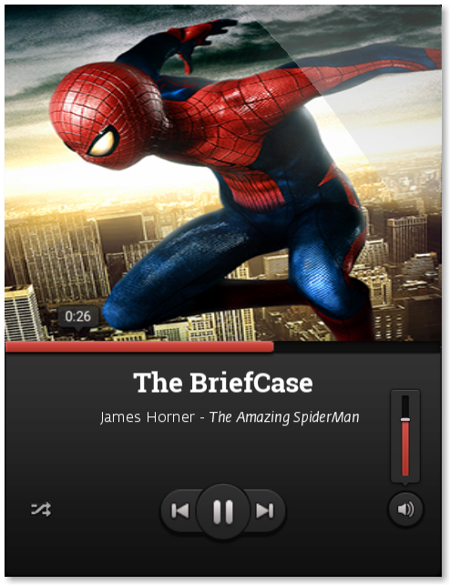

# Brief Music Player
A Simple/Stupid Music Player written in LÖVE :musical_note: for no purpose other than to demonstrate what could be done with [Lovely-Imgui](https://github.com/YoungNeer/lovely-imgui)!

 
  A look of the Brief (<i>For more see "screenshots"</i>)

## Features

I told you it's a simple music player so you shouldn't expect much features! It has volume slider, a slider for the music playback, and three buttons for Play,backward and forward and a toggle button for shuffle. (I'd have implemented Loop if i had access to a suitable loop image!)

## How it works?

The way it works is pretty simple (and also lame)! Just drag and drop the music you want to play and for thumbnails just drag and drop the image! If your music matches the format (as described in "music" folder) then it'd automatically find the artist name, song name and album name from the file!!

## Credit

Music Credit - https://freepd.com/misc.php
UI Design Credit - https://365psd.com

## Out of context stuff

I think it's my speciality to make apps just to demonstrate libraries - for eg [Arkanoid](https://github.com/YoungNeer/Arkanoid) was written only to demonstrate the "powers" of Anima, [Golf](https://github.com/ was also written to somewhat demonstrate auto-cursor. Both libraries never took off and turned out to be super-useless! I hope the same doesn't happen with LI :innocent:
